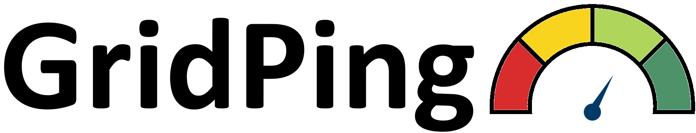

# GridPing — Smart Meter Dashboard

A mobile React web app that displays real-time power quality data for a residential smart meter node.

## What it does

- **Home tab** — live power quality dial, EV charge forecast, and area grid forecast
- **Analytics tab** — 24-hour PQ graph, last 3 meter readings, power quality table, and global grid state
- **Profile tab** — user settings and attributions

Power quality is scored 0–100% using an asymmetric tolerance band based on ANSI C84.1, where 100% = nominal voltage and deviations in either direction (overvoltage or undervoltage) reduce the score.

## Tech stack

| Layer | Technology |
|---|---|
| UI | React 19, Vite 7 |
| Data | AWS Lambda (via fetch) |
| Time | dayjs (UTC) |
| Styling | Inline style objects |

## Getting started

**1. Install dependencies**
```bash
npm install
```

**2. Set up environment**

Reach out to nikoloda@oregonstate.edu for `.env` file and place at the project root (the file is in .gitignore list):
```
VITE_LAMBDA_URL=______________
```

In development, requests are proxied through Vite (`/lambda`) to avoid CORS. In production, the full Lambda URL is used directly.

**3. Run locally**
```bash
npm run dev
```

**4. Test Lambda connectivity**
```bash
npm run test:lambda
```
This hits all four query types and prints the raw responses so you can verify the data pipeline without opening a browser.

## Lambda API

All data is fetched from a single Lambda function URL with a `query` parameter:

| Query | Parameters | Returns |
|---|---|---|
| `latest_bus` | `bus_id`, `target_time` | Most recent meter record for a bus |
| `bus_24h` | `bus_id`, `target_time` | All records for a bus in the 24h window ending at `target_time` |
| `latest_global` | `target_time` | Most recent global grid state record |
| `last_outage` | `bus_id`, `target_time` | Most recent outage record for a bus |

`target_time` format: `YYYY-MM-DD HH:mm:ss` (UTC). All responses follow `{ query, target_time, count, rows[] }`.


## Project structure

```
src/
  api/          # AWS Lambda fetch wrappers
  assets/       # Images and icons
  components/   # Shared UI components (LiveRefreshBar)
  dashboard/    # Bottom nav shell
  features/     # Page-level feature components
  frames/       # App layout (phone frame, routing)
  hooks/        # Data-fetching hooks (useGridData, useBus24h, useGlobalGridState)
  pages/        # Top-level pages (EasyPage, HardPage, UserPage)
  styles/       # Shared style constants
  utils/        # gridData.js — pqToPercent, pqLabel, utcNow, etc.
```

## Build

```bash
npm run build   # outputs to dist/
npm run preview # serves the dist/ build locally
```
